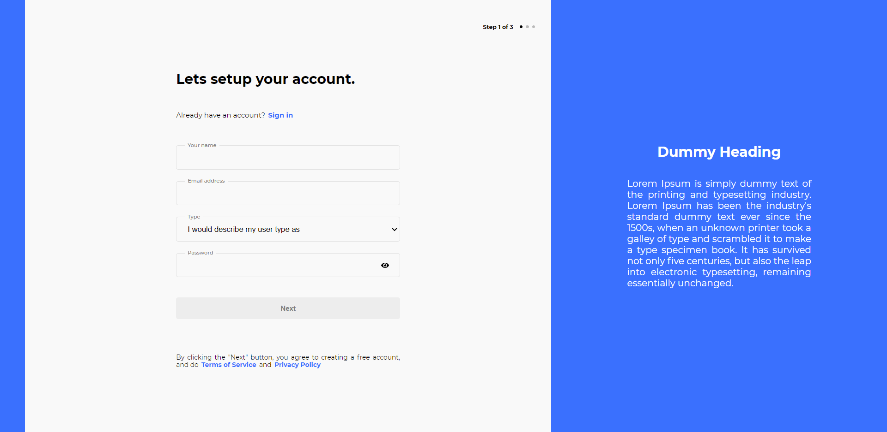

# IncSub Front-End Task

## Todo

- Build a template of given screenshot using ReactJS

## Instructions to execute task

- Install dependencies using - _npm install_
- Execute project using _npm run start_
- Navigate to -- **/signup** -- if not already on signup page.

## Screenshot

